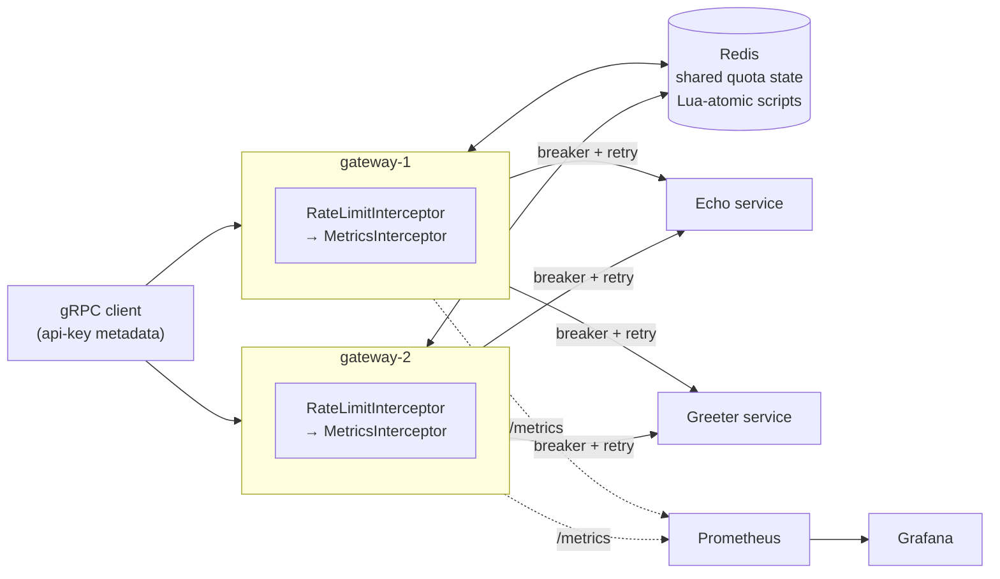
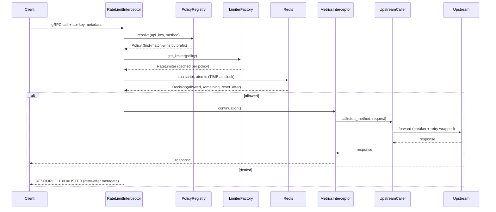
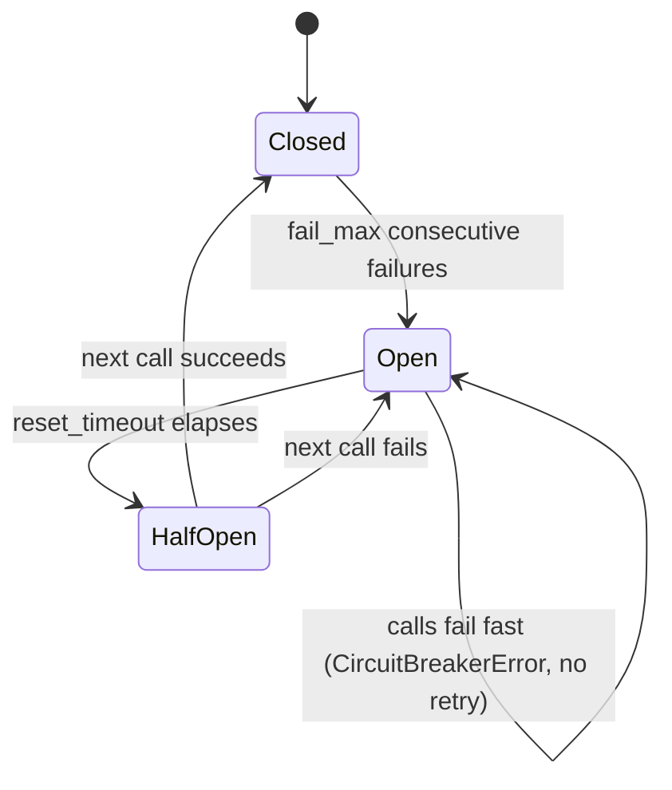
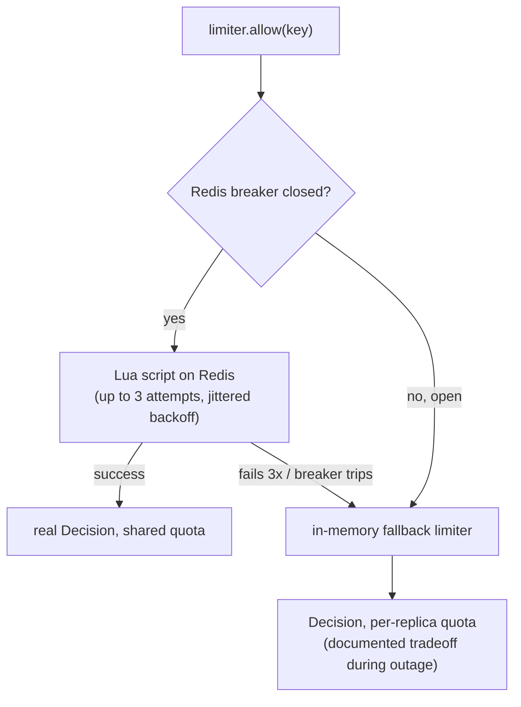

# Scalable API Gateway & Rate Limiter


Distributed gRPC API gateway with a pluggable, hot-swappable rate limiter (token-bucket and sliding-window-log, strategy pattern), circuit-breaker/retry reliability, and Prometheus/Grafana observability. Built in Python.

**Two replicas, one Redis, real numbers:** ~1,300–1,390 req/s sustained per replica, p99 ≈ 37–43ms, 0 errors — measured with [`ghz`](https://ghz.sh/) against the live docker-compose stack, not estimated. See [Benchmarks](#benchmarks).

## Contents

- [Benchmarks](#benchmarks)
- [Architecture](#architecture)
- [Request lifecycle](#request-lifecycle)
- [Reliability: circuit breaker + fail-open](#reliability-circuit-breaker--fail-open)
- [Quickstart](#quickstart)
- [Rate limit policies](#rate-limit-policies)
- [Demo: rate limiting in action](#demo-rate-limiting-in-action)
- [Demo: failure injection and circuit breaking](#demo-failure-injection-and-circuit-breaking)
- [Testing](#testing)
- [Load testing](#load-testing)
- [Design decisions](#design-decisions)
- [Scope boundaries](#scope-boundaries)

## Benchmarks

Real `ghz` runs (`./loadtest/run.sh`) against both gateway replicas simultaneously, 20,000 requests each, concurrency 30, sharing one Redis instance — the numbers below are what the tool printed, not rounded up:

| Replica | Requests | Throughput | p50 | p90 | p99 | Errors |
|---|---|---|---|---|---|---|
| gateway-1 | 20,000 | **1,390.3 req/s** | 20.27ms | 28.23ms | **36.76ms** | 0 |
| gateway-2 | 20,000 | **1,349.9 req/s** | 20.52ms | 28.95ms | **42.94ms** | 0 |

Both replicas clear 1,000+ req/s at sub-50ms p99 independently, while drawing quota from the exact same Redis-backed bucket — that's the "distributed" part actually holding up under load, not just working for a single request. Reproduce it yourself: `./loadtest/run.sh` (requires `ghz` and the stack running).

Test suite: **76 tests passing** (71 unit, 5 integration against a real Redis testcontainer), **92.66% line coverage** (gate enforced at 90% in CI).

## Architecture

Two gateway replicas share one Redis instance for rate-limit state — this is the distributed part: a client hitting either replica draws down the same quota. Each replica proxies allowed requests to two demo upstream gRPC services (Echo, Greeter) through a circuit-breaker + retry wrapped caller, and falls back to a local in-memory limiter if Redis becomes unavailable.

Full design rationale: [`docs/superpowers/specs/2026-08-12-api-gateway-rate-limiter-design.md`](docs/superpowers/specs/2026-08-12-api-gateway-rate-limiter-design.md).



## Request lifecycle

Every call passes through the interceptor chain in a fixed order — rate limiting is checked *before* anything touches the upstream service, and a denied request never reaches `MetricsInterceptor` (documented, deliberate: see `gateway/interceptors/metrics_interceptor.py`'s docstring on what that latency metric does and doesn't cover).



## Reliability: circuit breaker + fail-open

Every Redis call and every upstream call goes through the same shape: retry with jittered backoff, wrapped in a circuit breaker, with retry skipped entirely once the breaker's already open (no point burning attempts against a call guaranteed to fail for the rest of `reset_timeout`).



Redis and upstream calls diverge once a call fails, though: an upstream failure has nowhere sensible to go but `UNAVAILABLE` back to the client. A Redis failure falls open instead, since denying all traffic because the *rate limiter* is unreachable is worse than temporarily degrading to a per-replica limiter:



## Quickstart

```bash
docker-compose up --build
```

- Gateway replicas: `localhost:50051`, `localhost:50052`
- Metrics: `localhost:9101/metrics`, `localhost:9102/metrics`
- Prometheus: http://localhost:9090
- Grafana: http://localhost:3000 (anonymous admin access, dashboard pre-provisioned)

## Rate limit policies

Edit `gateway/config/policies.yaml` while the gateway is running — changes are picked up within ~2 seconds (file-watch poll), no restart required. Example:

```yaml
policies:
  - client_key_prefix: "free-"
    method: "/demo.Echo/Echo"
    algorithm: token_bucket
    limit: 50
    refill_rate_per_second: 50
```

Policies are resolved first-match-wins by `client_key_prefix` + exact method, falling back to the `default` block. A malformed edit is logged and ignored rather than crashing the watcher — it keeps serving the last-known-good policy set and retries the same edit every poll interval until it's fixed.

## Demo: rate limiting in action

```bash
grpcurl -plaintext -import-path protos -proto demo.proto \
  -d '{"message": "hi"}' -H "api-key: free-client-1" \
  localhost:50051 demo.Echo/Echo
```

(The gateway doesn't implement gRPC server reflection, so `-import-path`/`-proto` are required — grpcurl can't discover the service otherwise.)

Repeat past the configured limit to see `RESOURCE_EXHAUSTED`. Try the same `api-key` against `localhost:50052` — quota is shared across replicas, since both read/write the same Redis-backed bucket.

## Demo: failure injection and circuit breaking

```bash
FAILURE_RATE=1 docker-compose up -d --no-deps --build echo-service
```

Send a few requests through either gateway (`grpcurl` command above) — the Echo proxy's circuit breaker trips after repeated upstream failures, and `gateway_breaker_state_transitions_total` in Grafana shows the transition live. While the breaker is open, requests fail fast with `UNAVAILABLE` instead of retrying and hanging. Revert with:

```bash
FAILURE_RATE=0 docker-compose up -d --no-deps --build echo-service
```

## Testing

```bash
pip install -r requirements-dev.txt
pytest --cov --cov-report=term-missing
```

**76 tests, 92.66% coverage** (90% gate enforced in CI): 71 unit tests (rate limiters, policy hot-reload, circuit breakers, retry, interceptors, proxies) and 5 integration tests against a real Redis testcontainer and an in-process gRPC server — end-to-end rate limiting, failure-injection fail-open/recovery, and policy hot-reload against a live interceptor.

Requires Docker running locally (testcontainers spins the real Redis). `gateway/generated/` (protobuf stubs) is committed and ready to use — only regenerate it if you change `protos/demo.proto`:

```bash
./scripts/gen_protos.sh
```

## Load testing

Requires [`ghz`](https://ghz.sh/) installed locally and the stack running via `docker-compose up`.

```bash
./loadtest/run.sh
```

Results are written to `loadtest/results/*.json` and summarized to stdout (throughput, p50/p99 latency, status code distribution) — see [Benchmarks](#benchmarks) for the actual numbers from the last run.

## Design decisions

- **Lua scripts, not MULTI/EXEC** — atomicity is mandatory since multiple gateway replicas hit the same Redis keys concurrently.
- **Redis `TIME` as the clock** inside Lua scripts, not a client-supplied timestamp — avoids clock skew between replicas.
- **pybreaker + tenacity**, not hand-rolled — proven, well-tested implementations rather than reinventing breaker state machines. Retry is skipped once the breaker reports open, rather than burning attempts against a call that's already guaranteed to fail.
- **Fail-open on Redis outage** — falls back to a per-replica in-memory limiter rather than denying all traffic; documented tradeoff is temporarily inconsistent global quota during an outage.
- **Redis keys namespaced by method + policy shape** (limit/refill or limit/window), not just by client key — otherwise two unrelated per-route policies sharing an algorithm would silently drain the same bucket, and a hot-reloaded policy would inherit stale state from the config it replaced.
- **Hot-reload fails soft, not hard** — a malformed `policies.yaml` edit logs a warning and keeps serving the last-known-good policy set instead of killing the background watch task, so one bad edit can't silently disable hot-reload for the life of the process.

## Scope boundaries

Single Redis instance (no cluster/HA), gRPC-only client surface (no HTTP/REST), static API-key identity (no OAuth/JWT), no load balancer in front of gateway replicas. See the spec's "Out of scope" section for the full list and rationale.
